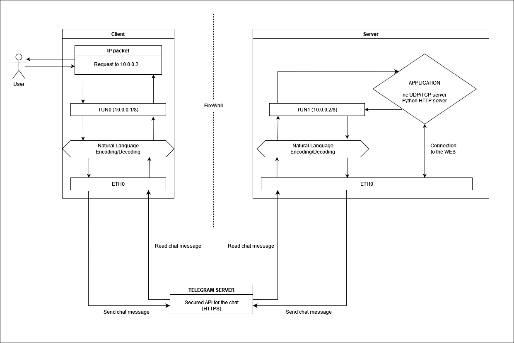

# ipOverTelegram

## ❓ About

This is an IP over Telegram project that builds a rudimentary tunneling service using a Telegram Bot. It allows the user to access a pre-configured server (for example a REST API) without creating any trafic between his machine and the server. All the package exchange is done via Telegram Bots, securely connected via the HTTPS protocol with a layer of language encoding.

On the client side, it uses a tunneling technique to intercept an outgoing request on Layer 3. It then encodes that request data in a Natural Language format and sends it to a Telegram chat via a bot. The server side then reads the message from the chat, decodes it and completes the request. The response is again encoded and sended via chat to be read by the client side bot and returned to the client application.

This project is part of the INF472D course concerning Network Programming.


## 🏗️ Compiling
This application uses the external library `cURL` to make API requests, and thus, you'll need to have the `libcurl` (or `libcurl-dev`) installed prior to the compilation.

To compile the code you need to first generate the makefile using CMake: 
```bash
cmake .;
```

And then generate the executables:
```bash
make;
```


## 🏃 Running
You will need to run this application on two different devices, one that will act as a client and the other that will act as the server.
Also some additional configuration with Telegram is necessary for this task

### Pre-configuring Telegram
For this application, you'll need two separate telegram bots that will "talk" with each other during the transmission: one for the client and one for the server.
To achieve this, use the documentation provided in https://core.telegram.org/bots/api and follow the steps provided:

1. Create (if you don't already have one) Telegram account.
2. Create two bots by talking with the BotFather contact on your account.
3. Create a transmission group in your telegram app and add the two bots as administrators.
4. Take note of the ID's for both bots and for the chat. Those values will need to be exported as environment variables for the next parts.


### Server-side
Here you can mask the IP with any class A IP mask. We recommend `10.0.0.2/8`.
To successfully run the server follow this steps: 

- export the Environment variables: 
```bash
export TELEGRAM_CHAT_ID=<YOUR_CHAT_ID>
export SERVER_BOT_ID=<YOUR_SERVER_BOT_ID>
```

- setting up the scripts:
```bash
chmod +x ./open_server_tunnel.sh 
./open_server_tunnel.sh <IP_MASK>
```

- executing: 
```bash
./server
```

Additionally, run a server-side application that the client will access, for example a netcat TCP server on any port `<PORT>`:
```bash
nc -l <PORT>;
```

Now all the incoming packets from the telegram chat will be processed by the server-side application and the responses returned to the client via the same chat.


### Client-side
In the client side you will need to export your bot data as environment variables (just like in the server side). The tunnel IP mask needs to intercept the packet directed to the server but not all the trafic from your machine (that would block the requests to telegram). We recommend an 8-bytes mask: `10.0.0.1/8`.

- export the Environment variables: 
```bash
export TELEGRAM_CHAT_ID=<YOUR_CHAT_ID>
export CLIENT_BOT_ID=<YOUR_CLIENT_BOT_ID>
```

- setting up the scripts:
```bash
sudo chmod +x ./open_client_tunnel.sh 
sudo ./open_client_tunnel.sh <IP_MASK>
```

- executing: 
```bash
./client
```


Now all your trafic that matches the IP mask provided will be redirected through the tunnel to the server. Eventual server responses will be read and reinserted to the local network to reach your client-side application.
One application example that will match the server side one is a netcat tcp client: 
```bash
nc 10.0.0.2 4444;
Hello world!
```


### Miscellaneous
To close any of the tunnels (for example TUNNEL_NAME=tun0), run:
```bash
sudo chmod +x ./close_tunnel.sh 
sudo ./close_tunnel.sh <TUNNEL_NAME>
```

Note that by default the client runs with the tunnel `tun0` and the server with the tunnel `tun1`.

## 🏯 Architecture
The code is separated in several modules with 2 main entrance points. 

The files `client.c` and `server.c` define the main entry-points for the applications.

The shared packages are:
- `encryptor`: responsable for encrypting and decrypting values, using a shared dictionary;
- `request`: get-request interface to allow for ease communication with the Telegram api. Uses the cURL library;
- `telegram`: interface that encapsulates the main functionalities of the bots in the application like sending and reading messages from a chat;
- `tunnel`: tunnel management/allocation functionalities;

External packages:
- `cURL`: to make easy https requests to the Telegram API;

More information on the packages can be found on their respective header files (in the `include` folder).

### Functioning schema



In this image we have the general functioning of the program:

1. An IP packet generated by the user (for example with a get request) directed to the server is captured by the tunnel in the layer 3;
2. The packet data is encoded as a message in a natural language format;
3. The message is sent using the `cURl` library and the Telegram api to a transmission list.
4. The same message is then read by the server; 
5. The server decodes the message, reconstructing the raw IP packet;
6. The packet is reinserted in the (local) network, reaching the server-side application (e.g. netcat TCP server);
7. The server-side app processes the packet, access the web and does what ever it needs to do with it;
8. The server-side app sends a response as an IP packet that is captured by the server tunnel. The capturing is running on a parallel thread for better performance;
9. The server then encodes the message and sends it to the telegram chat;
10. The client reads the message (in another thread for performance) and decodes it;
11. The client reinserts the raw packet in the network and it is received by the client-side application;
12. Your access to the server is complete!


What you have managed is to access a server-side application remotely while redirecting all the trafic to and from the server through an encoded (with natural language) and encrypted (HTTPS) Telegram message on a chat.
This allows you to have a server being protected by a firewall and still being accessible. Also the connection is super secure, so even if someone is monitoring your client or server network activity, they will not be able to identify or reconstruct the connection.
